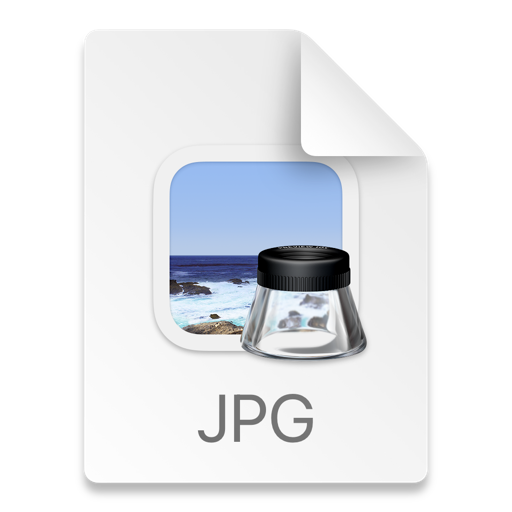

# Android-Scaling-algorithm-for-image

图像缩放算法总汇，使用C++实现。包含创建的插值算法和基于变换的算法

> 图像缩放算法可以分为两类：插值算法和基于变换的算法。下面是一些常见的图像缩放算法：

1. 最近邻插值算法（Nearest Neighbor
   Interpolation）：最简单的插值算法，对于每个缩放后的像素点，选择与其最近的原始像素点的值作为它的值。该算法容易实现，但会导致图像出现锯齿状的边缘。
2. 双线性插值算法（Bilinear Interpolation）：该算法在最近邻插值算法的基础上，加入了对相邻四个像素点的加权平均，使得图像边缘更加平滑。
3. 双三次插值算法（Bicubic Interpolation）：该算法在双线性插值算法的基础上，对相邻16个像素点进行加权平均，得到更加平滑的图像。
4. Lanczos插值算法（Lanczos
   Interpolation）：该算法使用了一种卷积方法，通过对像素点周围的采样点进行加权平均，得到缩放后像素点的值。该算法在保持图像细节的同时，会对图像进行轻微模糊。
5. Sinc插值算法（Sinc
   Interpolation）：该算法基于信号处理中的Sinc函数，使用卷积方法对像素点进行加权平均。该算法在保持图像细节的同时，会对图像进行一定的模糊，但比Lanczos插值算法的模糊程度小。
6.
基于变换的算法：除了插值算法，还有一些基于变换的算法，如双线性变换、双三次变换、图像金字塔等。这些算法会对原始图像进行一定的变换，再进行缩放。这些算法通常能够产生更高质量的缩放结果，但计算复杂度也更高。

